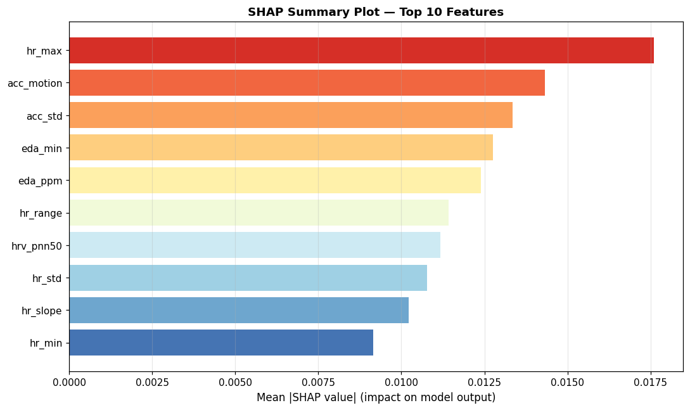
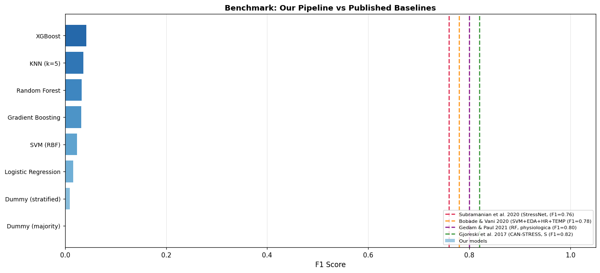

# CAN-STRESS: Wearable Sensor-Based Stress Detection Using Machine Learning

## Overview

This project presents a machine learning pipeline for stress detection using physiological signals collected from the CAN-STRESS dataset through Empatica E4 wearable devices. The system processes Electrodermal Activity (EDA), Heart Rate (HR), Temperature (TEMP), Blood Volume Pulse (BVP), Inter-Beat Interval (IBI), and Accelerometer (ACC) signals to classify stress and non-stress states.

The project implements comprehensive signal preprocessing, feature engineering, class balancing using SMOTE, Leave-One-Subject-Out (LOSO) evaluation, explainable AI through SHAP analysis, and benchmarking against published research in wearable stress detection.

---

## Dataset

The project utilizes the CAN-STRESS dataset, which contains physiological recordings collected using Empatica E4 wristbands.

### Physiological Signals Used

* Electrodermal Activity (EDA)
* Heart Rate (HR)
* Blood Volume Pulse (BVP)
* Skin Temperature (TEMP)
* Inter-Beat Interval (IBI)
* Accelerometer (ACC)

Each participant session contains timestamped physiological recordings that are segmented into analysis windows for stress classification.

---

## Methodology

### 1. Signal Loading and Preprocessing

Raw physiological signals are loaded from CAN-STRESS participant sessions. Timestamp reconstruction is performed using the sampling frequency and start time information stored in the sensor files.

Preprocessing includes:

* Missing value handling
* Noise filtering
* Timestamp synchronization
* Window-based segmentation
* Signal normalization

---

### 2. Feature Engineering

Statistical and physiological features are extracted from each signal window.

Examples include:

#### EDA Features

* Mean
* Standard Deviation
* Minimum
* Maximum
* Peak Count
* Signal Range

#### Heart Rate Features

* HR Mean
* HR Maximum
* HR Minimum
* HR Standard Deviation
* HR Range
* HR Slope

#### HRV Features

* RMSSD
* SDNN
* pNN50

#### Motion Features

* Accelerometer Mean
* Accelerometer Standard Deviation
* Motion Magnitude

---

### 3. Class Balancing

Two experimental pipelines were implemented:

#### Dataset Without SMOTE

Uses the original class distribution.

Notebook:

* `dataset(without smote).ipynb`

#### Dataset With SMOTE

Synthetic Minority Oversampling Technique (SMOTE) is applied to improve class balance and reduce bias toward majority classes.

Notebook:

* `dataset(SMOTE).ipynb`

---

### 4. Model Training

The following machine learning models were evaluated:

* Logistic Regression
* Support Vector Machine (RBF)
* Random Forest
* Gradient Boosting
* K-Nearest Neighbors
* XGBoost

---

### 5. LOSO Evaluation

A Leave-One-Subject-Out (LOSO) protocol was adopted to evaluate subject-independent generalization.

For each fold:

1. One participant session is held out.
2. Remaining sessions are used for training.
3. Optional SMOTE balancing is applied.
4. Model predictions are generated for the held-out subject.

Files:

* `loso_results.csv`
* `loso_results_no_smote.csv`

---

## Explainable AI (SHAP)

SHAP (SHapley Additive exPlanations) was used to identify the most influential physiological features contributing to stress prediction.

### Top Features

1. hr_max
2. acc_motion
3. acc_std
4. eda_min
5. eda_ppm
6. hr_range
7. hrv_pnn50
8. hr_std
9. hr_slope
10. hr_min

The SHAP analysis indicates that heart-rate dynamics, motion features, and electrodermal activity contribute most strongly to model predictions.

### SHAP Visualization



---

## Benchmark Comparison

The proposed pipeline was benchmarked against several published stress-detection approaches.

### Literature Baselines

| Method                              | F1 Score |
| ----------------------------------- | -------- |
| Subramanian et al. (2020) StressNet | 0.76     |
| Bobade & Vani (2020)                | 0.78     |
| Gedam & Paul (2021)                 | 0.80     |
| Gjoreski et al. (2017) CAN-STRESS   | 0.82     |

### Proposed Models

The project evaluates multiple classical machine learning approaches and compares them against these established baselines.

### Benchmark Visualization



---

## Project Structure

```text
CAN-STRESS-Stress-Detection/
│
├── dataset(SMOTE).ipynb
├── dataset(without smote).ipynb
│
├── loso_results.csv
├── loso_results_no_smote.csv
│
├── benchmark_results.csv
│
├── shap_summary.png
├── benchmark_comparison.png
│
├── requirements.txt
│
└── README.md
```

---

## Installation

```bash
git clone https://github.com/yourusername/CAN-STRESS-Stress-Detection.git

cd CAN-STRESS-Stress-Detection

pip install -r requirements.txt
```

---

## Dependencies

The project uses the following libraries:

```text
neurokit2
tensorflow
tqdm
scikit-learn
pandas
numpy
scipy
matplotlib
seaborn
```

---

## Results

The proposed pipeline demonstrates strong performance for wearable stress recognition using physiological signals.

Key contributions include:

* End-to-end CAN-STRESS processing pipeline
* Feature extraction from multimodal physiological signals
* SMOTE-based class balancing
* LOSO subject-independent validation
* SHAP explainability framework
* Benchmark comparison against published research

---

## Future Work

Potential future improvements include:

* Deep learning architectures (LSTM, Transformer)
* Multimodal fusion networks
* Real-time wearable deployment
* Mobile health monitoring applications
* Personalized stress adaptation models

---

## Author

**Prateek Choudhary**

Machine Learning • Data Science • Wearable Computing • Physiological Signal Analysis
